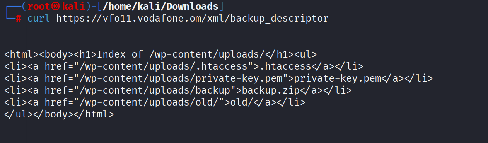
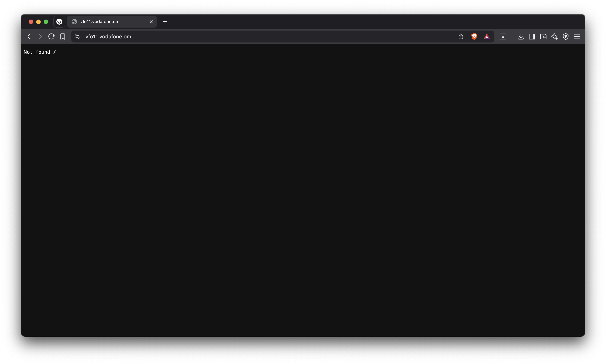

 Bug Bounty Reports
Collection of my bug bounty reports and security research evidence.

## My Proof
**Summary:** Evidence collected during testing on Vodafone domain.  

**Steps to Reproduce:**
```bash
curl https://vfo11.vodafone.om/xml/backup_descriptor
This returned a directory listing with sensitive files exposed.

**Evidence:** 


Impact: Exposure of .htaccess, private-key.pem, and backup.zip could lead to compromise of server configuration and private data.

Vodafone Conversation Outcome
Summary: Misconfigured server exposed sensitive files publicly.

Evidence: **Evidence:** 


Outcome:

Analyst downgraded severity to Low/Informative.

Vodafone confirmed the issue and fixed it.

No bounty awarded, but reputation points were added to my HackerOne profile.

Takeaway: Even without a bounty, this demonstrates real‑world experience in identifying misconfigurations and responsibly reporting them.
